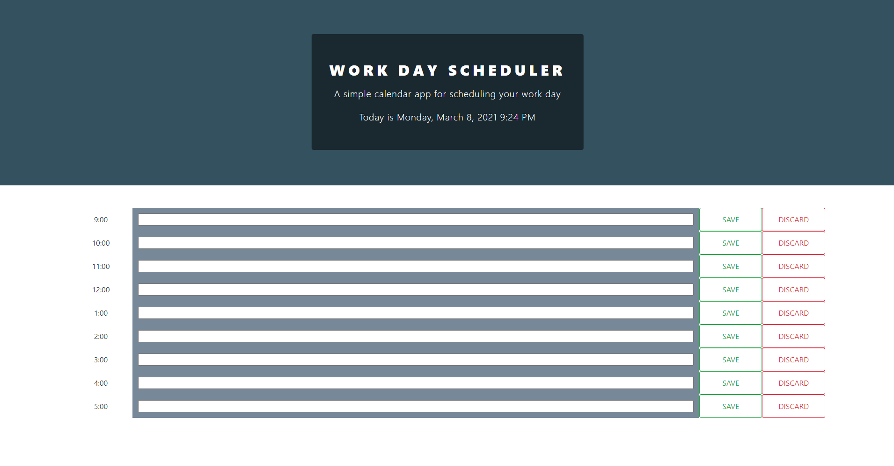

# work-day-scheduler

## This Repository

In this project, I was tasked with building an online calendar for project tracking, from scratch, to practice Bootstrap, Moment and jQuery. With this program one can store their text using the save button to local storage so it stays even when refreshing the browser or closing it and coming back. There is also a discard button for someone to delete the item and from the calendar completely. The blocks of time will recognize if the time is past, present, or future and will be color coded accordingly.

In order for people with different screen sizes to view the site, I added responsiveness.

## How To
* Click on the text box and type your meetings/note for yourself
* Click save to save to local storage
* Clear contents using the discard button

### Important Link and Screenshots
* [deployed site](https://breyera.github.io/work-day-scheduler/)
